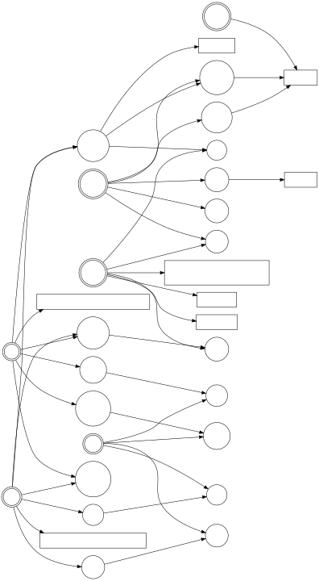

# 紫微斗数排盘

根据倪海厦天纪和紫微斗数全书（南北山人）排布诸星。

```
2024-01-13 10:27:00 +0800 CST

匿名 癸卯年 腊月初三 巳时 阴女 木三局
命主:廉贞 身主:天同 子斗:午

甲子 官禄:
    破军庙化禄 禄存庙 天姚 红鸾
    沐浴 博士 (咸池) (天德)
    43-52 2,14,26,38,50,62

乙丑 交友:
    天机陷 擎羊庙 寡宿 截空 天伤
    冠带 力士 月煞 (吊客)
    53-62 1,13,25,37,49,61

甲寅 迁移:
    紫微旺 天府庙 火星庙 天月庙
    临官 青龙 亡神 病符
    63-72 12,24,36,48,60,72

乙卯 疾厄:
    太阴陷化科 铃星利益 左辅庙 天魁庙 天哭 天使
    帝旺 小耗 将星 岁建
    73-82 11,23,35,47,59,71

丙辰 财帛:
    贪狼庙化忌 地劫 阴煞 天空
    衰 将军 攀鞍 晦气
    83-92 10,22,34,46,58,70

丁巳 子女:
    巨门旺化权 文昌庙 天钺 三台 天福 天马 孤辰 蜚廉 破碎 旬空
    病 奏书 岁驿 (丧门)
    93-102 9,21,33,45,57,69

戊午 夫妻 身宫:
    廉贞平和 天相庙 地空 恩光 天官 天喜
    死 飞廉 息神 贯索
    103-112 8,20,32,44,56,68

己未 兄弟:
    天梁旺 封诰 解神 龙池 凤阁
    墓 喜神 (华盖) (官符)
    113-122 7,19,31,43,55,67

庚申 命宫:
    七杀庙 天刑 月德
    绝 病符 (劫煞) 小耗
    3-12 6,18,30,42,54,66

辛酉 父母:
    天同平和 文曲庙 八座 天虚 天寿
    胎 大耗 灾煞 大耗
    13-22 5,17,29,41,53,65

壬戌 福德:
    武曲庙 天贵
    养 伏兵 天煞 龙德
    23-32 4,16,28,40,52,64

癸亥 田宅:
    太阳陷 右弼庙 陀罗陷 台辅 天巫 天厨 天才
    长生 官府 指背 (白虎)
    33-42 3,15,27,39,51,63
```

### 安星路径路（甲级星）


### 安星路径路（其他星）


